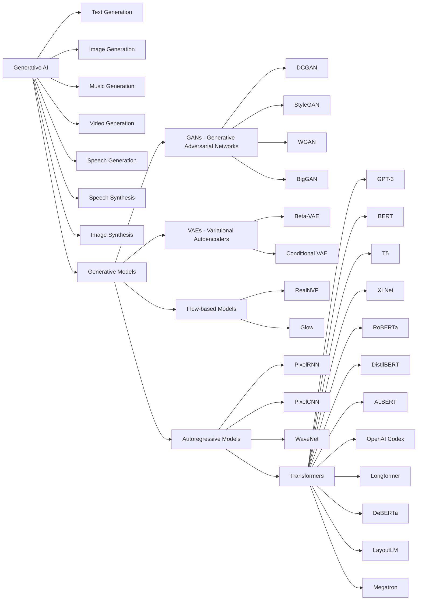

# Generative AI Landscape

```mermaid
graph LR
A[Generative AI] --> B[Text Generation]
A --> C[Image Generation]
A --> D[Music Generation]
A --> E[Video Generation]
A --> F[Speech Generation]
A --> G[Speech Synthesis]
A --> H[Image Synthesis]
A --> I[Generative Models]
I --> J[GANs - Generative Adversarial Networks]
I --> K[VAEs - Variational Autoencoders]
I --> L[Flow-based Models]
I --> M[Autoregressive Models]
J --> N[DCGAN]
J --> O[StyleGAN]
J --> P[WGAN]
J --> Q[BigGAN]
K --> R[Beta-VAE]
K --> S[Conditional VAE]
L --> T[RealNVP]
L --> U[Glow]
M --> V[PixelRNN]
M --> W[PixelCNN]
M --> X[WaveNet]
M --> Y[Transformers]
Y --> Z[GPT-3]
Y --> AA[BERT]
Y --> AB[T5]
Y --> AC[XLNet]
Y --> AD[RoBERTa]
Y --> AE[DistilBERT]
Y --> AF[ALBERT]
Y --> AG[OpenAI Codex]
Y --> AH[Longformer]
Y --> AI[DeBERTa]
Y --> AJ[LayoutLM]
Y --> AK[Megatron]
```
